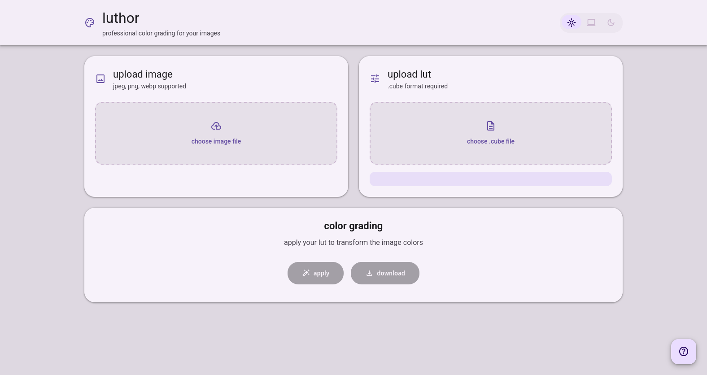
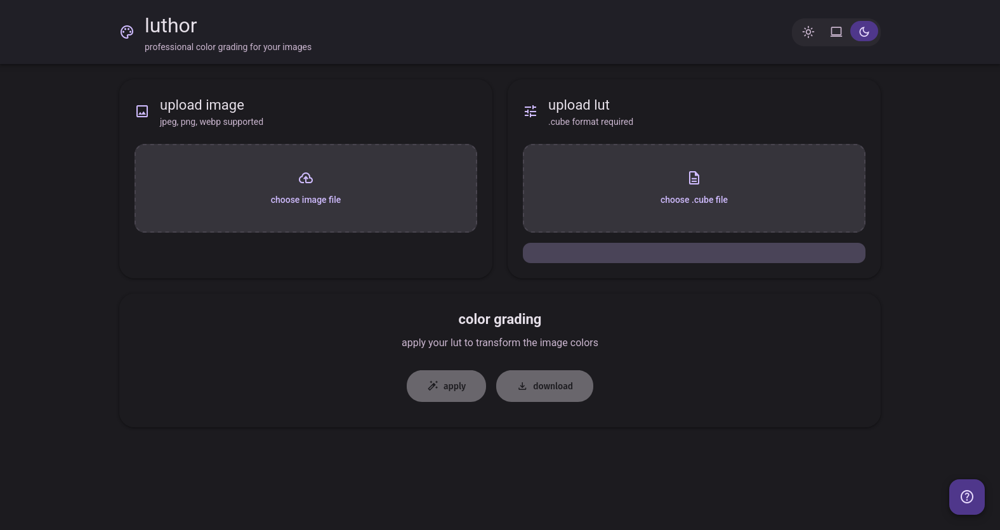

# luthor

**luthor** is a modern, material you-inspired web app for applying 3D LUTs (`.cube` files) to images directly in your browser. It features light/dark/system theme support, and instant image processing and download—all with no server or account required.

---

## features

- **material you ui**: dynamic, accessible, and responsive design
- **theme toggle**: light, dark, or system (auto) mode
- **drag & drop**: upload images and `.cube` lut files easily
- **instant processing**: applies 3d luts with trilinear interpolation for smooth color grading
- **auto download**: processed image is downloaded automatically
- **no server**: all processing is done in your browser, your files never leave your device
- **mobile friendly**: works great on desktop and mobile

---

## usage

1. **clone or download this repo**
2. open `main.html` in your browser (no build step required)
3. upload an image (jpeg, png, webp)
4. upload a `.cube` lut file
5. click **apply lut & download**
6. your color-graded image will be downloaded automatically

---

## screenshots

---

## supported formats

- **images**: jpeg, png, webp
- **luts**: 3d `.cube` files (standard format)

---

## license

[mit](LICENSE)

---

## credits

- material you design by google
- icons: [material symbols](https://fonts.google.com/icons)

---
